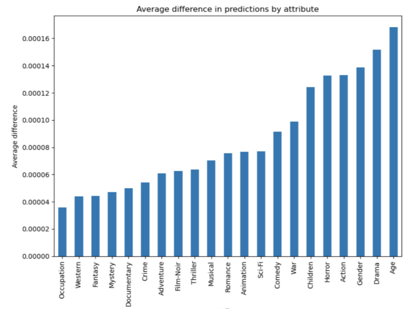
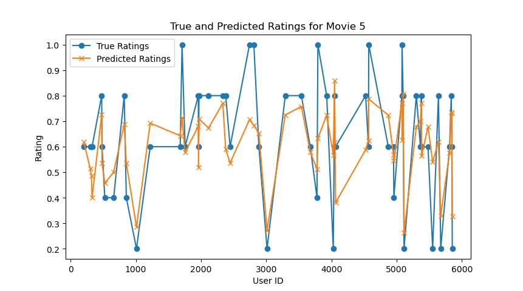
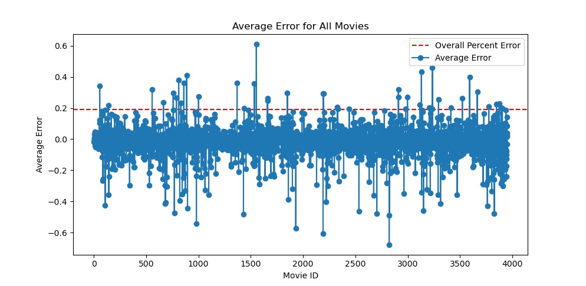

# JNCF-Recommender-Systems

Joint-Neural Collaborative Filtering for Recommender Systems

# Collaborators

<small>Keanan Milton</small>

# Dataset

We used the dataset of **MovieLens 1M** movie ratings from 6000 users on 4000 movies. Released in 2003.Download the **ml-1m.zip** file from the link below. After uncompressing the file please drag the 3 files **movies.dat**, **users.dat**, and **ratings.dat** into the **dataset/raw** folder.
ml-1m.zip

[https://grouplens.org/datasets/movielens/1m/](https://grouplens.org/datasets/movielens/1m/)

# Libraries
We follow this article posted by apple to install tensorflow-metal to work on M1 family of chips.

[https://developer.apple.com/metal/tensorflow-plugin/](https://developer.apple.com/metal/tensorflow-plugin/)

# Notes

We currently working on improving my model's accuracy, and we like to address some challenges we have encountered. One issue is that the loss function suddenly becomes infinite at certain epochs which has poses a significant obstacle. This is a known problem, and we're actively researching and experimenting to solve this issue.

# Graphs

The findings above showes that certain attributes of users and items had a significant impact on the accuracy of predictions in the JNCF model. Specifically, age, drama, gender, and action were found to be more likely to produce accurate predictions, while other attributes like occupation, Western, Fantasy, and Mystery did not result in a significant improvement in prediction accuracy. These results suggest that users’ demographics and preferences for certain genres can have a stronger influence on their likelihood of enjoying a particular item. Interestingly, the study also found that some attributes that are commonly thought to be important, such as occupation, did not have a significant impact on prediction accuracy.This highlights the need for careful feature selection when building collaborative filtering models, as certain attributes may be more important than others in accurately predicting user preferences.

The image above depicts the accuracy of the JNCF model in predicting users’ movie preferences. The model was able to achieve a good level of accuracy, accurately predicting a large proportion of users’ preferences. These results demonstrate the effectiveness of collaborative filtering in identifying the movies that users are likely to enjoy. The level of accuracy is particularly noteworthy given the complexity of predicting users’ preferences, and suggests that the model has the potential to improve the user experience by providing highly relevant recommendations. Overall, the results highlight the power of collaborative filtering in accurately predicting users’ movie preferences, and suggest that it can be an effective approach for developing recommendation systems.

The image displayed above illustrates the distribution of average error per user in the JNCF model. The x-axis represents all users in the dataset, and the y-axis represents the average error per user. The dashed line on the chart indicates the average error for all users, which was found to be around 17%. Interestingly, the graph shows a wide range of error rates among different users, with some users having very low error rates and others having very high error rates. These results suggest that the effectiveness of the model may vary significantly depending on the individual user.